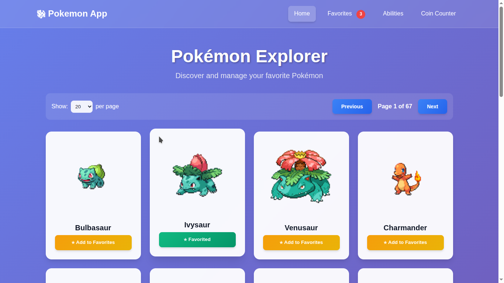
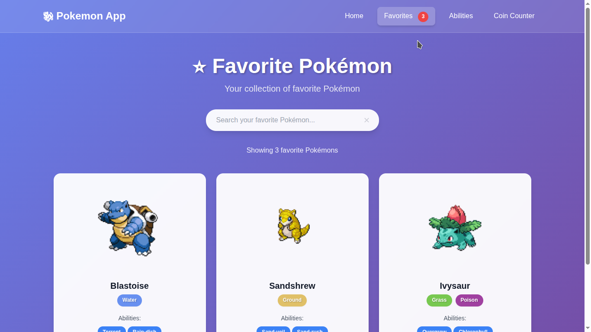
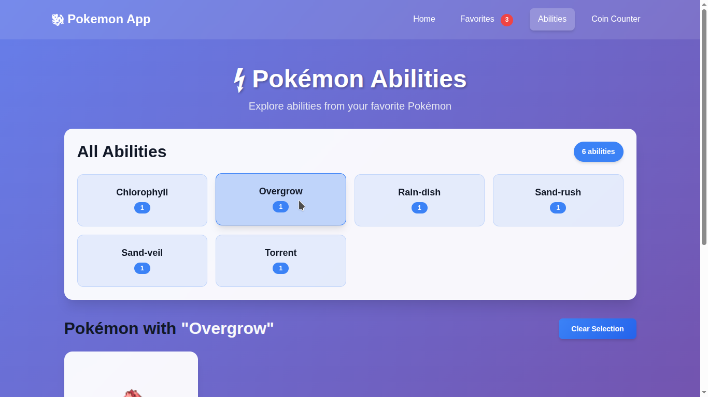
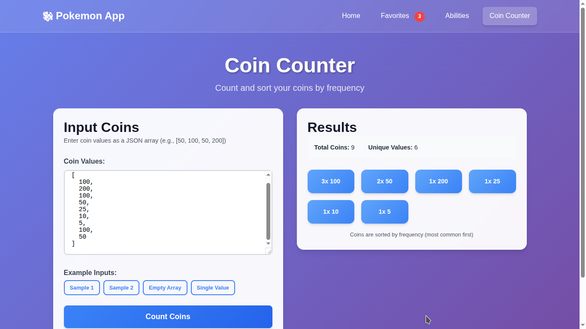
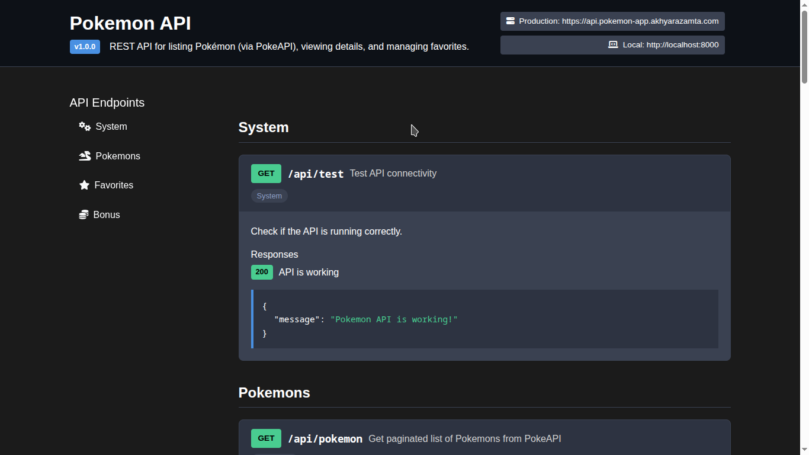
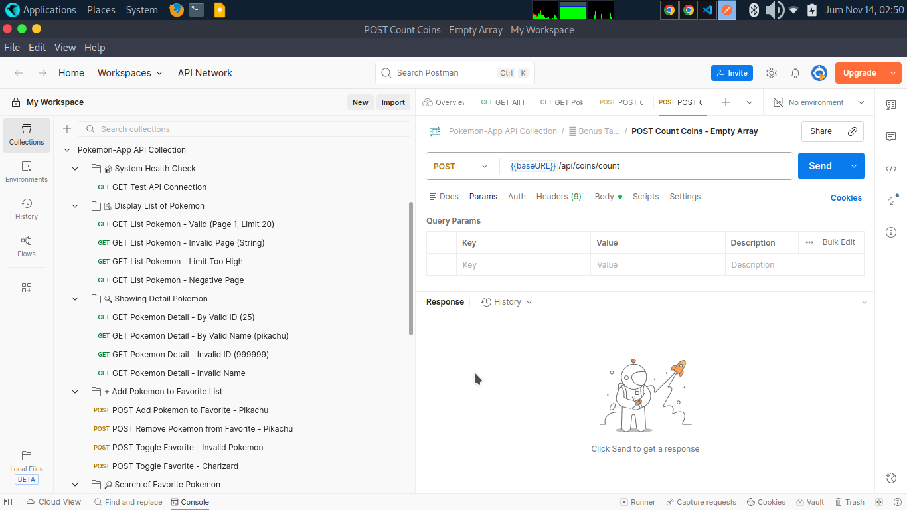
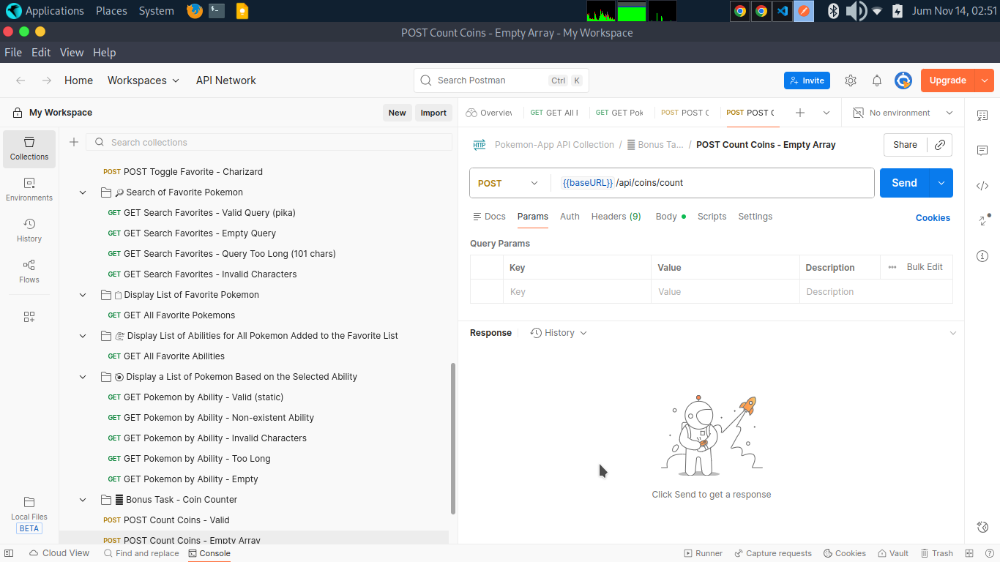
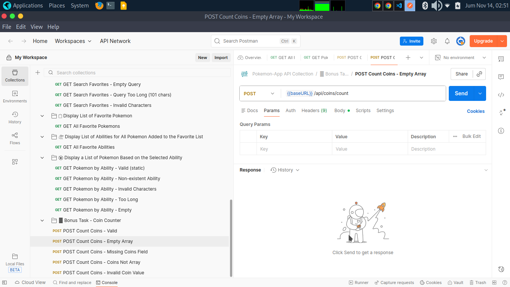

# Pokemon Fullstack App

## Frontend Preview





##

## Backend Preview






# 🎯 Evaluation Checklist

### ✅ Completed Requirements
- **Correctness of the solution**: ✅ Complete – All endpoints working as specified with proper error handling
- **Code quality & readability**: ✅ Complete – Clean, documented code following Laravel & Vue.js best practices
- **Input validation process**: ✅ Complete – Comprehensive validation including data types, formats, and error responses
- **Filtering capabilities**: ✅ Complete – Advanced filtering with query parameters for pagination, search, and abilities
- **JSON Resource/Transformer**: ✅ Complete – Implemented Laravel API Resources for optimized data transformation
- **Unit testing**: ✅ Complete – Comprehensive test suite covering controllers, models, and services

### ✅ Bonus Features Completed
- **MongoDB Integration**: ⌛ Pending
- **Laravel Vapor Deployment**: ⌛ Pending
- **Netlify Deployment**: ✅ Complete
- **Coin Counter Task**: ✅ Complete
- **API Caching**: ✅ Complete

🚀 Live Demos

- Frontend: 
``` 
https://pokemon-app.akhyarazamta.com
https://pokemon-app-akhyarazamta.netlify.app
```
- Backend API: 
```
https://api-pokemon-app.akhyarazamta.com
```
- API Docs: 
```
https://api.pokemon-app.akhyarazamta.com
```

🛠 Technology Stack

**Backend:** Laravel 12, MySQL, PHPUnit

**Frontend:** Vue.js 3, Axios

**DevOps:** Docker, Git, Postman

# 🏗 Setup Instructions

### Prerequisites
- PHP 8.3+, Composer, Node.js 18+, MySQL

### Backend Setup
```bash
cd backend
composer install
cp .env.example .env
php artisan key:generate
php artisan migrate
php artisan serve
```

### Frontend Setup
```bash
cd frontend
npm install
npm run dev
```

### Docker Setup
```
docker compose up --build
```

### Postman Colllection
Import this Colllection: [postman_collection](./postman_collection.json)

# 📡 API Endpoints

### Pokémon Management
- GET /api/pokemon – List all Pokémon (paginated)
- GET /api/pokemon/{id} – Get Pokémon details
- POST /api/pokemon/{id}/favorite – Toggle favorite status

### Favorites
- GET /api/favorites – List all favorites
- GET /api/favorites/search?q={name} – Search favorites by name
- GET /api/favorites/abilities – Get unique abilities from favorites
- GET /api/favorites/ability/{ability} – Get favorites by ability

### System
- GET /api/test – API health check
- POST /api/coins/count – Coin counting (Bonus)

### 🚀 Testing

#### Backend Tests
```bash
php artisan test
php artisan test --testsuite=Unit
php artisan test --testsuite=Feature
```
#### Frontend Tests
```bash
npm run test:unit
npm run test:e2e
```

📄 License

MIT License © 2025 Pokemon Favorites Project
